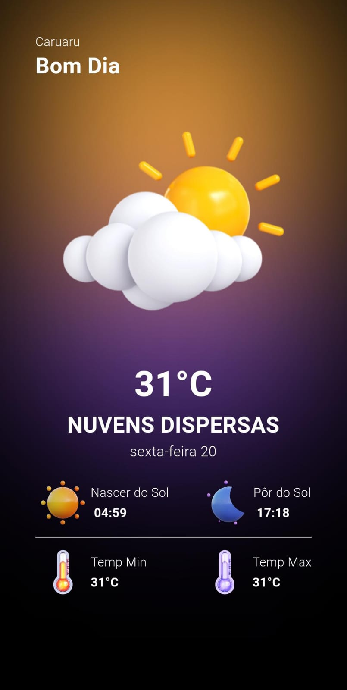

# Weather App

Este é um aplicativo de previsão do tempo que exibe informações sobre o clima atual, como temperatura atual, nascer do sol, pôr do sol, temperatura mínima, temperatura máxima e outras informações relevantes. A interface do aplicativo é dinâmica e muda com base na hora e nas condições climáticas.
É um projeto feito para o estudo e aplicação da ferramenta BLOC.

## Recursos Principais

- Exibição de informações dinâmicas com base na hora do dia.
- Integração com a Weather API para obter dados de previsão do tempo em tempo real.
- Usuário recebe informações especificas relacionadas a sua localização atual.

## Capturas de Tela



## Configuração

Antes de usar o aplicativo, siga estas etapas:

1. Crie uma conta na Weather API e obtenha sua chave de API.
2. Renomeie o arquivo `.env.sample` para `.env`.
3. No arquivo `.env`, substitua `YOUR_API_KEY` pela sua chave de API da Weather API.

## Executando o Aplicativo

Para executar o aplicativo, você precisa ter o Flutter e o Dart instalados no seu ambiente de desenvolvimento. Siga estas etapas:

1. Clone este repositório no seu computador:

   ```bash
   git clone https://github.com/GabrielPz/weather_app.git
   ```

2. Execute os seguintes comandos:

   flutter pub get
   flutter run
